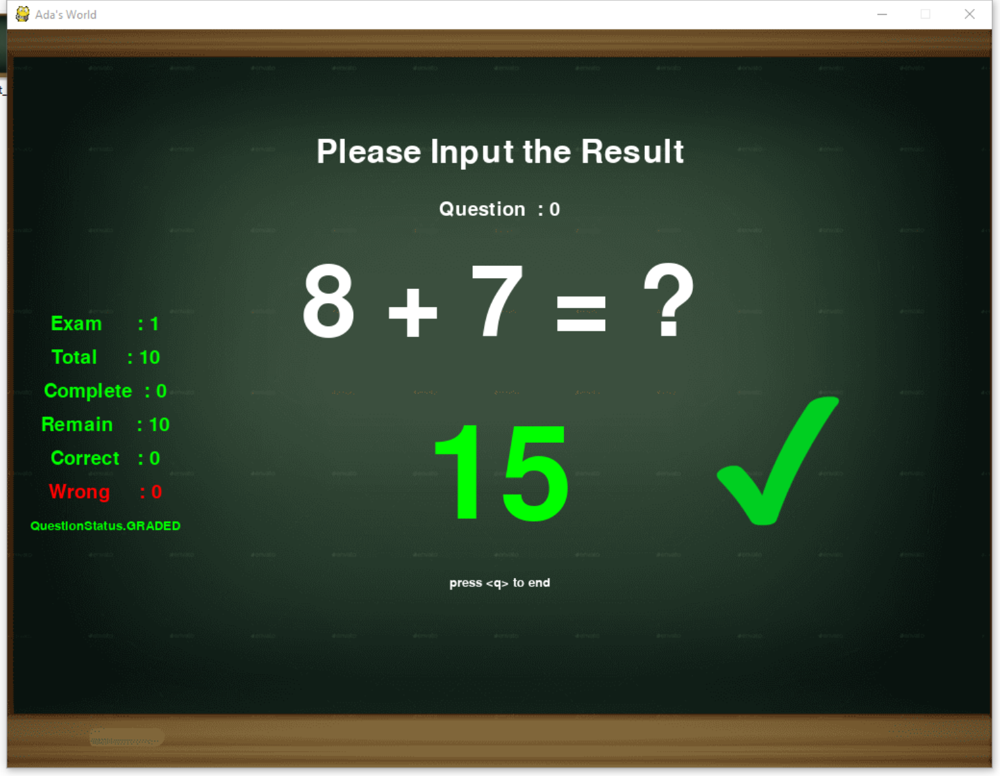

# Adarith
Adarith is an arithmetic game for pre-school kids, so they can practise and have fun. Ada loves to play with it, 50+ artithmetics per day.


## Quick Start
It is now does not support quick installation. Please clone the repo and run in python 3 ENV on Windows.

Install Python 3 For Windows:
----------------------------

[Download Python 3.8 For Windows](https://www.python.org/ftp/python/3.8.2/python-3.8.2.exe)

Install virtualenv
------------------
```bash
pip install virtualenv
```

Create wenv38
-------------
```bash
virtualenv -p python3 --system-site-packages wenv38
cmd:PATHTOWENV38/Scripts/activate
```

Run adarith
-----------

```bash
cmd: cd to PATHOFADARITH/adarith/
cmd: python main.py
```

Requirements:
------------

```
pip install pygame

# For Text To Speech
pip install pyttsx3
pip install pypiwin32
```

## Snapshots





## Features

- Multi Scene Switch
- Arithmetic Generation
- Grade Dashboard
- TTS

## Pending List

- User Identification
- Questions Persist and Statistics
- Points Collection
- UIKit Libraty based on pygame